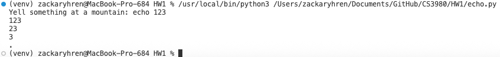
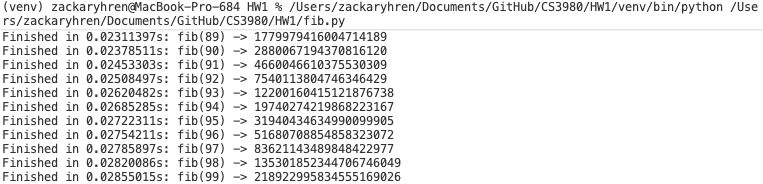
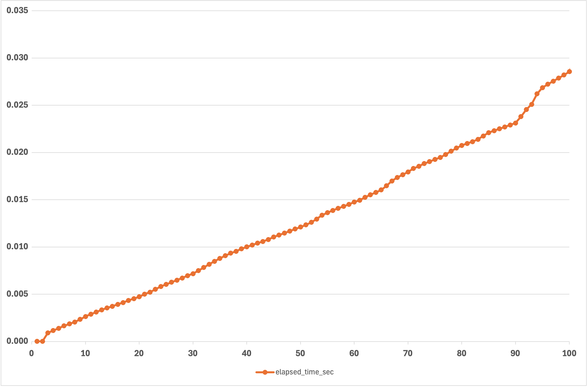

# Python Programming Basics & Decorators Assignment

## Overview

This repository contains my submission for a Python programming assignment consisting of two parts:

1. **Python Programming Basics** – implementing a function that simulates a real-world echo  
2. **Python Decorator Implementation** – optimizing a recursive Fibonacci function using decorators and analyzing execution time

The repository includes Python source code, screenshots of code and output, a performance plot, and this README file documenting the work.

---

## Repository Structure

```
.
├── echo.py
├── fib.py
├── fib.png
├── screenshots/
│   ├── echo_output.png
│   └── fib_output.png
└── README.md
```

---

## Part 1: Python Programming Basics — `echo.py`

### Description

The file `echo.py` implements a function named `echo()` that imitates the fading echo of a sound shouted at a mountain. The echoed sound gradually shortens to represent the loss of sound energy over time.

### Function Signature

```python
def echo(text: str, repetitions: int) -> str:
```

- **text**: a string representing what is yelled at the mountain  
- **repetitions**: an integer representing how many times the sound echoes  
- **return value**: a string representing the echoed sound with a fading effect  

---

### Example Execution

```bash
$ python echo.py
Yell something at a mountain: Helloooo
ooo
oo
o
.
```

```bash
$ python echo.py
Yell something at a mountain: echo 123
123
23
3
.
```

---

### Screenshot: Echo Output



---

## Part 2: Python Decorator Implementation — `fib.py`

### Description

The file `fib.py` implements a recursive function to compute the *n*th Fibonacci number. Since recursive Fibonacci calculations are computationally expensive, two decorators are used to optimize and analyze performance:

1. **`lru_cache`** from Python’s `functools` module to cache previously computed results  
2. **A custom `timer` decorator** to measure and display execution time  

---

### Function Signature

```python
def fib(n: int) -> int:
```

The function computes Fibonacci numbers recursively and prints the execution time for each evaluated input value.

---

### Example Output

```text
Finished in 0.00000070s: f(1) -> 1
Finished in 0.00000130s: f(0) -> 0
Finished in 0.00045070s: f(2) -> 1
Finished in 0.00050900s: f(3) -> 2
...
Finished in 0.00831470s: f(100) -> 354224848179261915075
```

---

### Screenshot: Fibonacci Output



---

## Performance Analysis

Execution times for Fibonacci calculations were recorded and plotted as a function of the input value *n*. The resulting graph visualizes how execution time changes as the size of the Fibonacci number increases.

---

### Fibonacci Execution Time Plot



---

### Plot Explanation

- **X-axis**: Fibonacci input value (*n*)  
- **Y-axis**: execution time in seconds  

Although naive recursive Fibonacci implementations have exponential time complexity, the use of the `lru_cache` decorator significantly improves performance by eliminating redundant computations. As a result, execution time increases gradually rather than exponentially.

---

## Environment

- **Python Version**: Python 3.14.2
- **Libraries Used**:
  - `functools`
  - `time`

---

## Author

**Zackary Hren**
