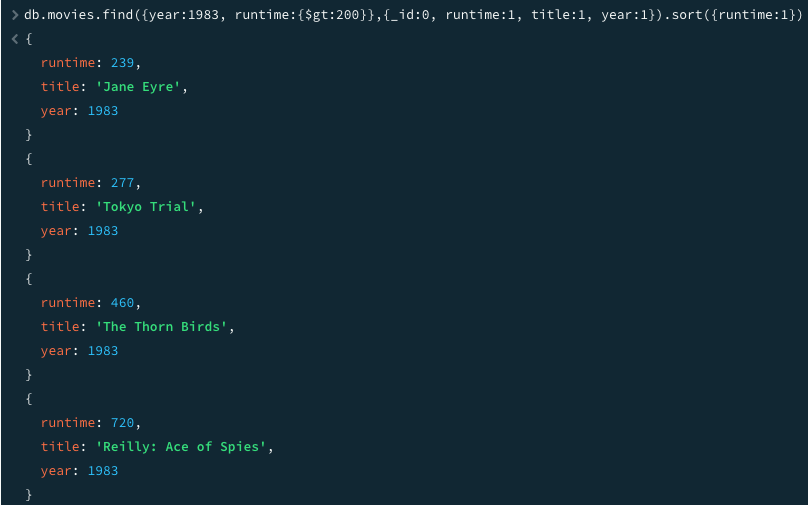
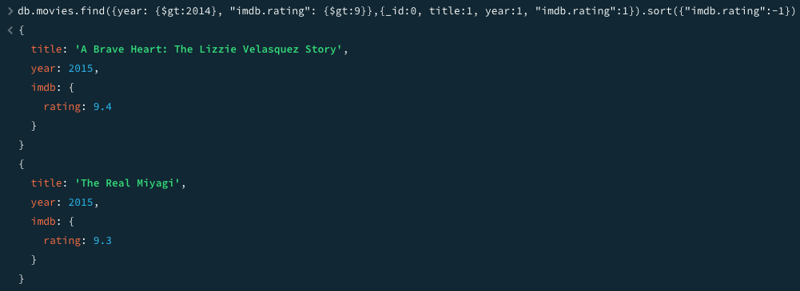

# MongoDB Query Exercises – sample_mflix Database

## Overview

This document demonstrates two MongoDB queries executed in **mongosh** against the **sample_mflix.movies** collection. Each query includes:

- the exact query used
- a description of the objective
- a screenshot showing both the query and its results

---

## Query 1: Movies from 1983 with Runtime Greater Than 200 Minutes

### Objective

Retrieve all movies released in **1983** with a runtime greater than **200 minutes**, sorted by runtime in ascending order. The output includes only:

- runtime
- title
- year

### Query

```javascript
db.movies.find(
  { year: 1983, runtime: { $gt: 200 } },
  { _id: 0, runtime: 1, title: 1, year: 1 }
).sort({ runtime: 1 })
```

### Screenshot



---

## Query 2: Movies After 2014 with IMDB Rating Greater Than 9

### Objective

Retrieve all movies released **after 2014** with an **IMDB rating greater than 9**, sorted by rating in descending order. The output includes only:

- title
- year
- imdb.rating

### Query

```javascript
db.movies.find(
  { year: { $gt: 2014 }, "imdb.rating": { $gt: 9 } },
  { _id: 0, title: 1, year: 1, "imdb.rating": 1 }
).sort({ "imdb.rating": -1 })
```

### Screenshot



---

## Summary

These queries demonstrate:

- filtering using comparison operators (`$gt`)
- accessing nested fields using dot notation (`imdb.rating`)
- projecting specific fields
- sorting query results
